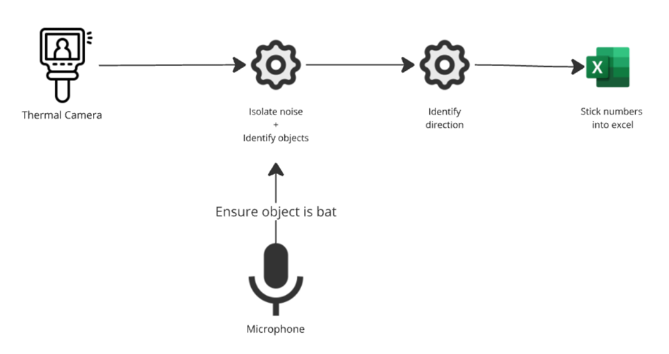
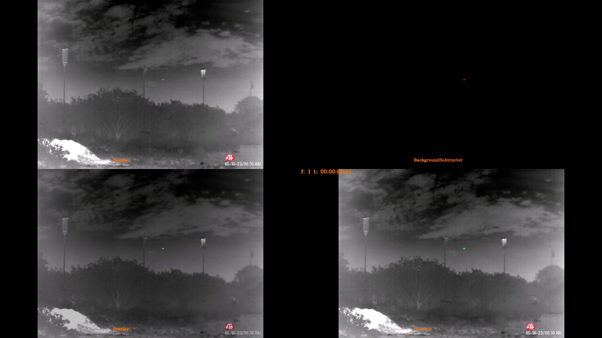

# Bat-O-Meter

A project to see if it is possible to count bats using object detection methods

# Overview



This repository is currentlty structured to:

1. Iterate over each frame of a video and detect moving objects
2. Clean moving objects from noise
3. Track real moving objects over successive frames
4. (WIP) Understand the direction of each object

Files:

- `main.py` → runs program and cleans objects found
- `objectfinder.py` → detects objects
- `tracker.py` → tracks cleaned objects

## Demo

The project in its current state applies a background subtracter to isolate moving objects. Tracking and object identification is then needed.


Individual isolations:



# Installation

1. Install python 3.9.18

2. Set up virtual environment:

```shell
python -m venv .venv
.venv/Scripts/activate
pip install -r requirements.txt
```

3. Run the program

```shell
    python main.py
```

# References

- [Motion Detection: Part 3 - Background Subtraction](https://medium.com/@itberrios6/introduction-to-motion-detection-part-3-025271f66ef9) → Introduction to background subtraction.
- [Intro to OC-SORT - Robust Multi-Object Tracking](https://medium.com/@itberrios6/introduction-to-ocsort-c1ea1c6adfa2) → Algorithm to fill in missing detections for moving objects.
- Worth looking into seeing if something like [YOLO](https://docs.ultralytics.com/models/yolo11/) can just do this out the box.
